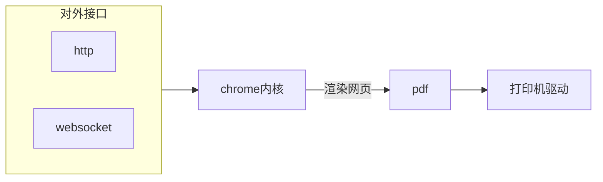

# 一个实现网页打印自动化的工具

[source code](https://github.com/zerlei/WebpagePrinter)

假设你在开发一个后台管理系统，你使用 web 技术来开发前端，你的客户通过浏览器访问你的应用。你可能会有这样的需求，把一些信息打印到纸张之上。你的做法如下：

1. 使用 html 和 css 来制作符合打印需求的静态内容，使用 js 嵌入一些动态内容
2. 借用第三方组件，或者直接使用`window.print()`，当你的用户做出类似于点击一个按钮这样的操作时，打开浏览器的打印预览对话框
3. 你的用户在浏览器的打印预览对话框里进行下一步的选择打印机、纸张等操作

这种情况下，每一个打印需求都需要你的用户手动触发。如果打印经常发生，你可能会考虑，可以让这个流程自动化吗？我们预先配置好打印机、打印格式等，当打印需求产生时不需要用户手动触发打印，而是让打印自动完成。

因为浏览器的安全策略，在常规浏览器上仅仅依靠网页是无法完成的，这个小工具的作用就是帮助你实现网页的自动化打印，它是一个客户端软件，你需要把它安装在能连接相应打印机的电脑上。

它的工作方式:



它的工作流程:

1. 通过 http 或者 websocket 与之交互
2. 使用 chrome 内核打开网页,并渲染生成 pdf
3. 将图像传递到选择的打印机队列

> [!NOTE]
>
> **如果你使用 Http 请求的方式，并且发起 http 请求的地点是在浏览器的网页上**，请注意[更私有的跨域策略](https://wicg.github.io/private-network-access/)
>
> ~~你可以在 chrome 内核浏览器中设置 chrome://flags/#block-insecure-private-network-requests 为 disabled 来避免更私有的跨域策略。~~(现在已经无法设置了)
>
> 它的 http 返回头已包含：
>
> ```javascript
> Access-Control-Allow-Origin:*
> Access-Control-Allow-Methods: GET, POST
> Access-Control-Allow-Private-Network: true
> Access-Control-Allow-Credentials: true
> ```
>
> 当请求打印服务的 ip 是 localhost,因为浏览器的安全策略,http 请求会因跨域出错.
> **此时建议使用 websocket 的方式**

## 0-安装

[下载](https://github.com/zerlei/WebpagePrinter/releases)

支持 windows 和 linux.

### 0.1 windows

1. 需要最新的 vc++运行时包[这里](https://aka.ms/vs/17/release/vc_redist.x64.exe)
2. [nssm](https://nssm.cc/) 类似于 systemd,把普通的应用程序做成一个服务.

### 0.2 linux

linux 版本使用 nix 做成了一个沙箱程序(glibc 都包含),可以在复杂的 linux 各种发行版中打开即用.

但是有这些问题:

1. 包体积实在是太大了,600 多 M
2. qt 后台**最佳**渲染机制在不同桌面环境是不同的,还和硬件即驱动有关.所以不可能在沙箱环境中编译出完全适配所有 linux 发行版的程序.因此在运行程序时设置变量`QT_XCB_GL_INTEGRATION=none QT_QUICK_BACKEND=software`,参考代码中的 r.sh,这导致程序会变慢一些
3. 因为是在沙箱,也就是隔离环境中运行,所以不能调用 host 的程序,所以最后一步 LastProcess 不能使用

### 0.3 配置文件

位于当前用户根目录`.WebpagePrinter`文件夹下.

windows:

```powershell
cd ~/.WebpagePrinter
```

linux:

```bash
cd ~/.WebpagePrinter

```

第一次运行时会生成默认的配置文件:

./config.ini

```
[General]
http_server_ip=0.0.0.0
http_server_port=8845
local_websocket_server_ip=0.0.0.0
local_websocket_server_port=8846
remote_websocket_server_url_only_ws=

```

修改后重启生效.

一共有三种连接方式:

1. 此程序作为一个 http server
2. 此程序作为一个 websocket server
3. 此程序作为一个 websocket client

### 0.4 前台工具页面

在linux 版本中 将压缩包文件夹 `wwwroot` 复制到目录`~/.WebpagePrinter`下,windows版本无需处理.

打开 http://127.0.0.1:8845

## 1 功能接口

前台页面工具:


如同前台工具页面描述,你需要首先定义一个config. 指定打印机 纸张大小等.然后再根据config,去发出一个print 请求.

参考注释: 1. [config](https://wpp.zerlei.cn/structPrinterConfig) 2. [page](https://wpp.zerlei.cn/structPrintedPage)


无论使用任何一种连接方式,数据格式都是`json`,不同连接方式,相同意义请求,传递的内容一致.

- http 统一使用 POST 请求,url `/command` **所有内容放在 body 中**

example: 


```javascript
fetch("/command", {
  method: "POST",
  headers: {
    "Content-Type": "application/json",
  },
  body: JSON.stringify({
    method: "get_websocket_server_port",
    uid: 0,
  }),
})
  .then((response) => response.json())
  .then((data) => {
    console.log(data)
  });
```

- websocket 使用textmessagae


### 1.1 获得工具安装电脑上的打印机和纸张信息

### 1.2 添加一个打印配置

### 1.3 获得打印配置

### 1.4 删除一个打印配置

### 1.5 更改一个打印配置

### 1.6 发一个打印命令

### 1.7 获得打印过的页面

### 1.8 获得 websocket 端口


## 2 源码和编译

如果使用nix (开启flake支持),快速获取所有开发配置:

```bash
gh repo clone zerlei/WebpagePrinter

# 进入nix 环境
nix develop

# 配置 cmake
./c.sh 

# 构建
./b.sh 

# 运行
./r.sh 

# 测试 !!! 修改 ./tests/CMakeLists.txt 的打印机和纸张名称,否则会出错

cd build 

ctest .

```

如果不使用 nix,本项目的依赖也十分简单

1. 支持 c++23的编译器
2. 最新的cmake
3. qt 6.9.1(额外模块参考 ./github/workflows/win.yaml)
4. (可选)doxygen 用于生成文档页面
5. (可选)java 和 plantuml jar 用于doxygen 生成图像
6. (可选)graphviz 用于doxygen 生成图像

## 3 安全问题

当你使用这个工具时，你的打印机可能会在"不知不觉"中被控制，如果你的对应端口是开放的，那么控制你打印机的地方可能在远端。
